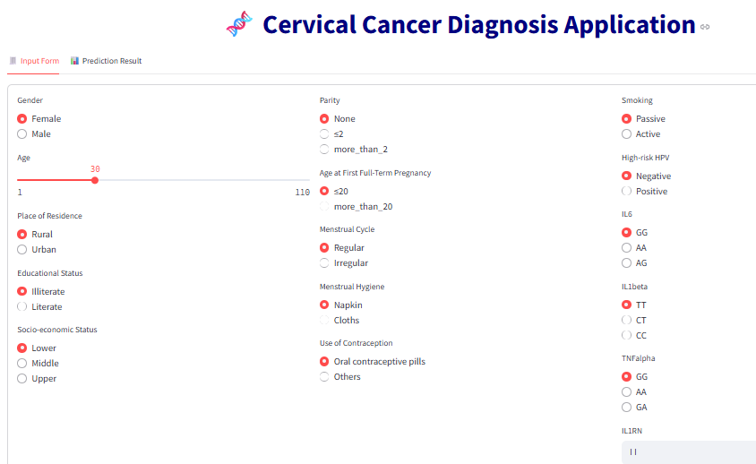
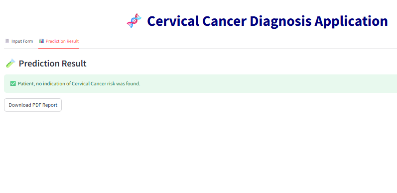
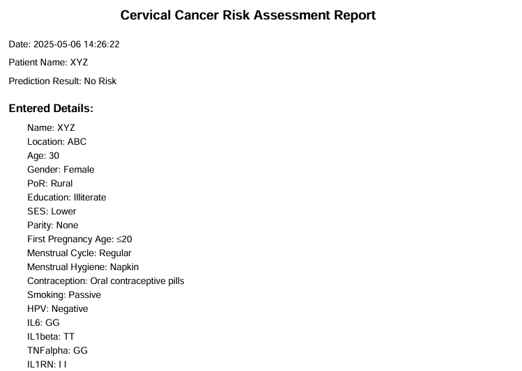

# 🧬 Cervical Cancer Risk Prediction App

An AI-powered, multilingual web application built with **Streamlit** that predicts the risk of cervical cancer based on patient input. It supports PDF report generation and is accessible online.

🔗 **Live App**: [https://cervicalcancertest.streamlit.app/](https://cervicalcancertest.streamlit.app/)

---

## 🧰 Features

- ✅ **Predicts cervical cancer risk** using a pre-trained machine learning model.
- 🌍 **Multi-language support**: English 🇺🇸, Hindi 🇮🇳, Spanish 🇪🇸, French 🇫🇷.
- 📝 **Patient details collection** via a user-friendly sidebar form.
- 📋 **Tabbed UI** for easy navigation: Form Input | Prediction Output.
- 📄 **Downloadable PDF report** including patient data and prediction result.
- 🧠 **Model flexibility**: Easily plug in your own `.pkl` model.

---

## 📸 Screenshots

| Input Form | Prediction Tab | PDF Download |
|------------|----------------|--------------|
|  |  |  |

---

## 🚀 Getting Started Locally

### 1. Clone the Repository

```bash
git clone https://github.com/sanjanachauhan2008/cervical_cancer.git
cd cervical_cancer
```

### 2. Install Dependencies

If a `requirements.txt` file is provided, run:

```bash
pip install -r requirements.txt
```

If not, manually install the core dependencies:

```bash
pip install streamlit numpy joblib reportlab
```

### 3. Add the Trained Model

Place your `cervicalcancer.pkl` file (a joblib-serialized scikit-learn model) in the project root. The model should accept input features in the required order (see below).

### 4. Run the App

```bash
streamlit run your_script_name.py
```

---

## 📂 Project Structure

```
📁 cervical-cancer-predictor/
├── cervicalcancer.pkl              # Trained ML model (user-provided)
├── your_script_name.py            # Streamlit app code
├── README.md                      # This file
└── requirements.txt               # Dependency file
```

---

## 🌐 Language Support

This app currently supports the following languages:

- English 🇺🇸  
- Hindi 🇮🇳  
- Spanish 🇪🇸  
- French 🇫🇷  

Additional languages can be added through the `translations` dictionary in the source code.

---

## 🧠 Model Requirements

Your trained model should expect the following features in this exact order:

```python
[Age, Place of Residence, Educational Status, Socio-Economic Status, Parity, Age at First Parity, Menstrual Cycle, Menstrual Hygiene, Use of Contraception, Smoking, HRHPV, IL6, IL1beta, TNFalpha, IL1RN]
```

- All features must be numerically encoded.  
- Feature processing is already handled in the app's backend.

---

## 📄 PDF Report

Each report includes:

- Patient name and location  
- Date and time of prediction  
- Predicted risk result  
- All entered form values  

📥 PDF can be downloaded directly from the result tab after prediction.

---

## 📌 Acknowledgements

- **Model serialization**: `joblib`  
- **Web app framework**: `Streamlit`  
- **PDF generation**: `ReportLab`  

---

## 📬 Contact

For any issues, questions, or contributions, please [open an issue](https://github.com/yourusername/cervical-cancer-predictor/issues) on the GitHub repository.

---

⭐ **If you find this project useful, please give it a star on GitHub!**
